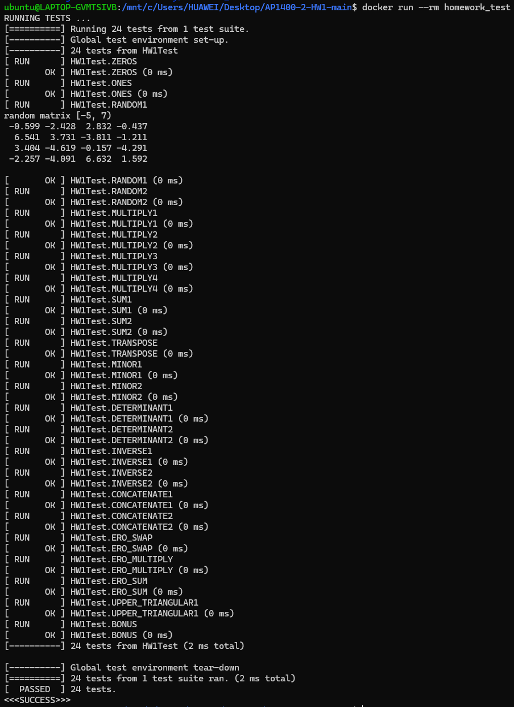

# HW1

---

注：在原版基础上修改 `CMakeLists.txt` 中 `set(CMAKE_CXX_STANDARD 14)` 为

```
set(CMAKE_CXX_STANDARD 17)
```

 



#### some ideas:

1. 测试时要将 `unit_test.cpp` 中的 `/*  */` 删掉，并把 `main.cpp` 中的 `True` 改为 `False` 

2. 分界线 `//--------` 将要求的函数和自己定义的函数分隔开

3. `logic error` 只需要 

   ```C++
   #include <stdexcept>
   throw std::logic_error("string");
   ```

4. `random` 使用

   ```C++
   // 创建一个随机数设备作为种子
   std::random_device rd;
   // 使用 rd 的输出作为 mt19937 引擎的种子
   std::mt19937 gen(rd());
   // 定义一个在 [min,max] 范围内均匀分布的浮点数
   std::uniform_real_distribution<> distrib(min,max);
   ```